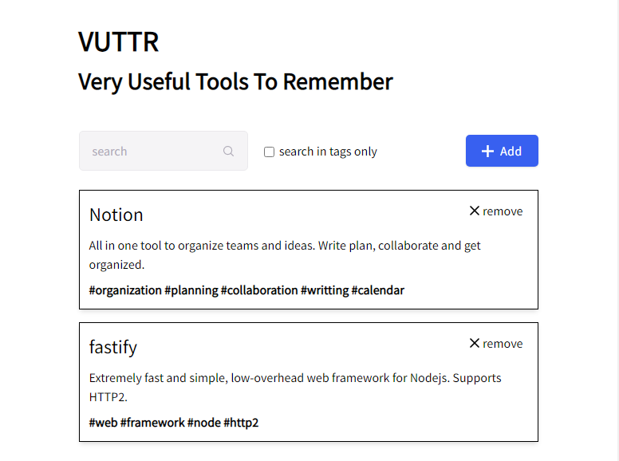
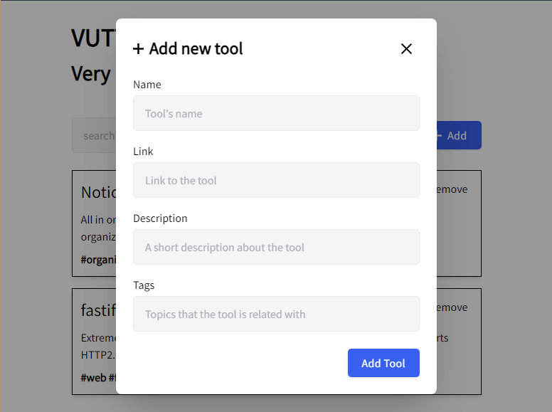
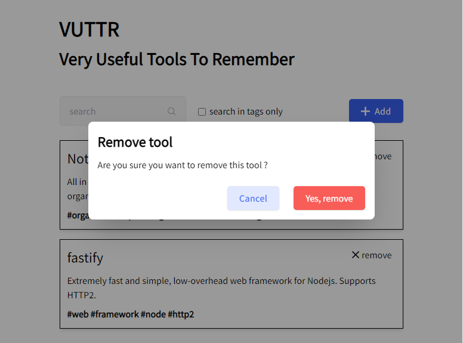
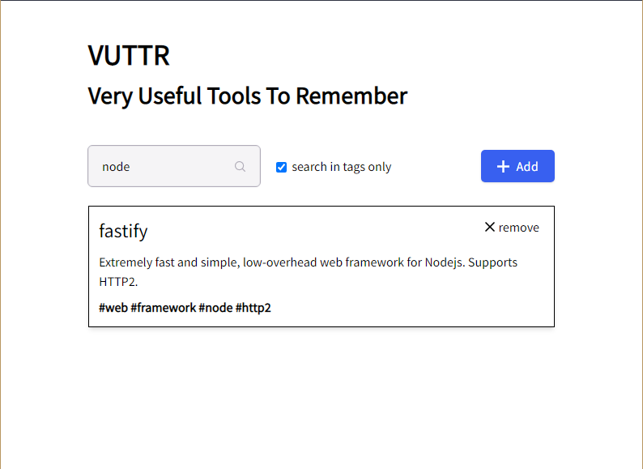

<!-- What is the project about -->
# Introduction
This is a challenge taken from the [Front-end Challenges](https://github.com/felipefialho/frontend-challengesrepository) repository.

For more context on the challenge itself you can take at [here](https://www.notion.so/Front-end-c12adcdbe7a1425dbfbcd5a397b4ff10).

## Screens
### 1: The user is able to see the list of all registered tools

### 2: The user is able to add a new tool

### 3: The user is able to remove a tool

### 4: The user is able to search tools dynamically (globally or just using tags)

## Technologies
**Project is created with**:
- HTML5
- CSS3
- JavaScript